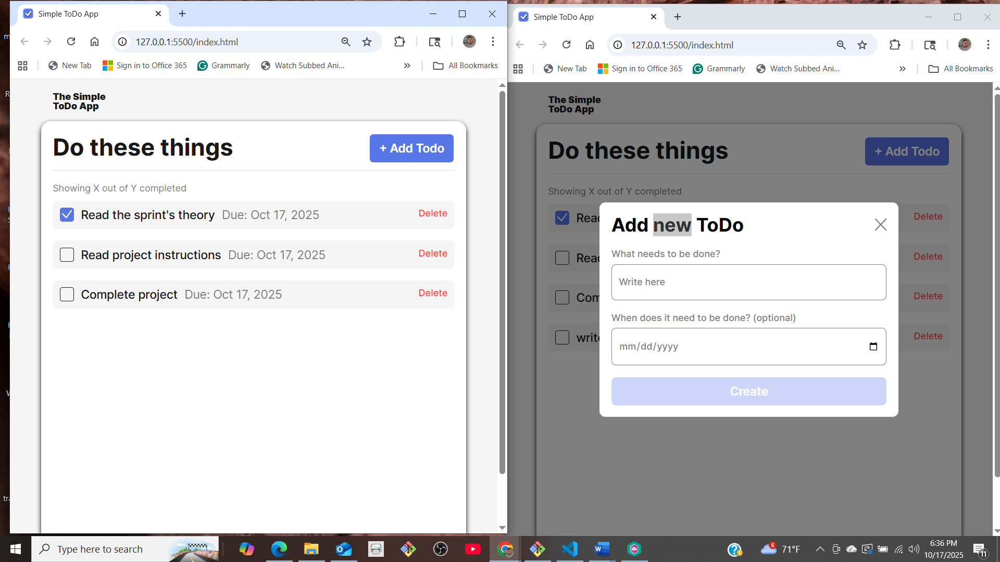
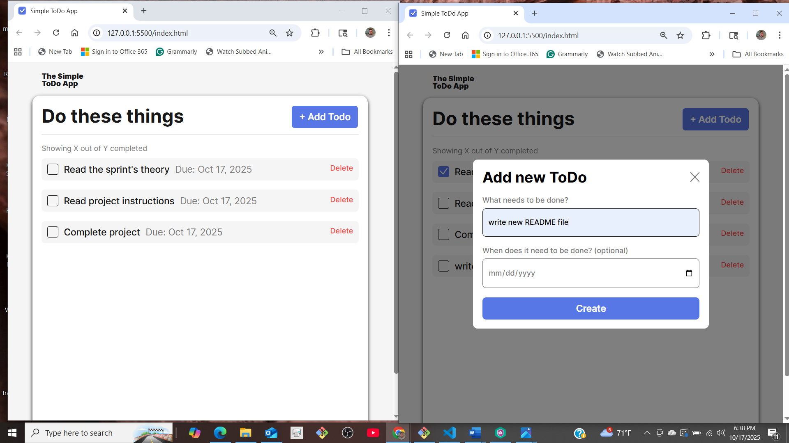
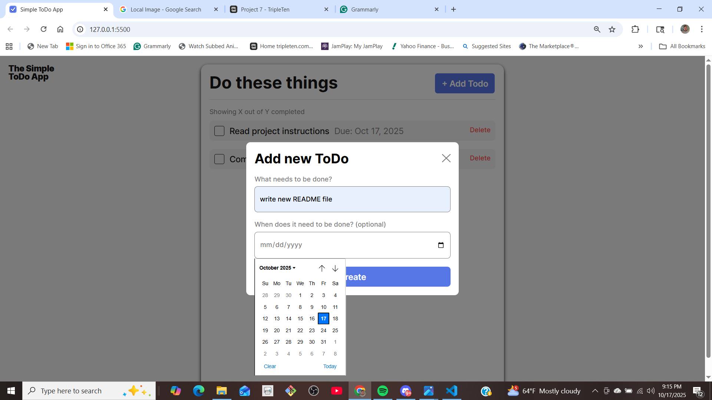
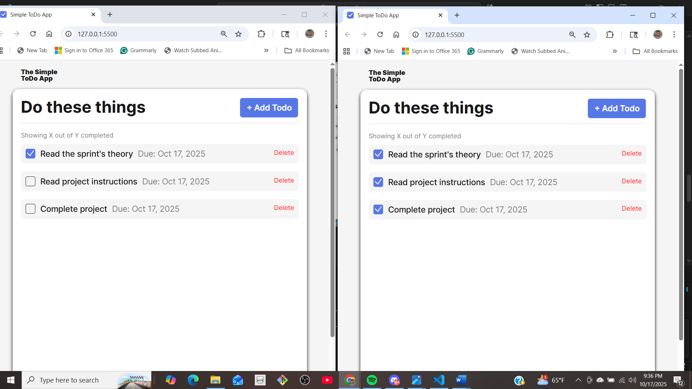
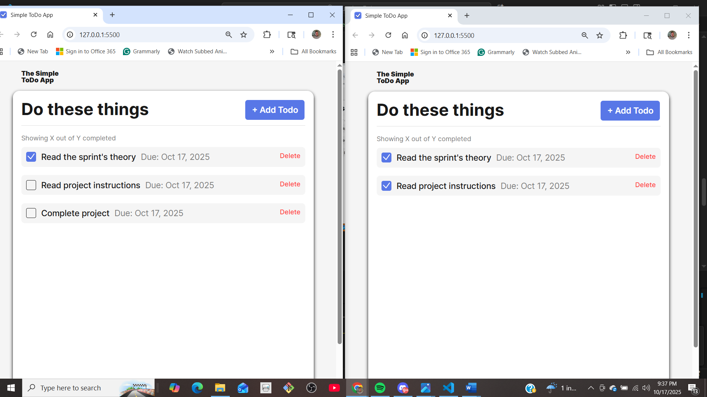

# Simple Todo App

The Todo App is a user-friendly application that lets users create a to-do list with the option to add due dates. The checkboxes are used to track the completion of each task. The add button enables the user to add new functions to the list. Each task has its own delete button to remove it from the list.

## Functionality

### Adding/creating todos

- Click "Add Todo" button
- "Create" button will remain disabled until the first input field is filled with more than 2 characters
- Fill the input field with the placeholder "Write here"
- Replace input field with a to-do task
- Enter the due date manually or use the calendar date picker
- Click the "Create" button to submit and close the modal
- click "X" button on the upper right of the modal to close

### Delete task from to-do list

- select task field window
- click "Delete" button at the end of the field window
- To-do list will realign the order of the list

## Give a more detailed explanation of the project and its functionality.

- The first input field is filled with the task being specified if it does not violate the attributes for this input field. The condition for this input field should have a minlength of 2 characters and a maxlength of 40 characters. When the input field error "Please lengthen this text to 2 characters or more (you are currently using 1 character)" is present, the "Create" button remains disabled until the task input field contains a proper to-do. The second input field represents the optional due date for the to-do task. The to-do date can be implemented by putting the month, day, and 4-digit year, or by using the calendar date picker. After the first input field has a valid input, the "Create" button is enable to submit to-d0 task to the current task list. Each new task is added to the end of the task list; however, the deletion of a task is not efected by order of the list.

- The main Todo app page will display the to-do list with a checkbox to navigate the completion of the specified task. Each task can be deleted from the list by using the "Delete" button at the end of the task field window. Once the task has been deleted, it cannot be recalled and requires resubmission. This also relates to the "X" close button at the top left of the modal, as using it resets the data in the input fields to a clear state for a fresh start.

## Technology

### HTML5

- Sematic markup and form elements
- Dynamic content redering

### CSS

- Resposive design and modern style
- Interactive UI components

### JavaScript ES6+

- Object = orented programing with classes
- Event handling and DOM manipulation
- Form validation and data management

### Application Navigation Flow

**1. Opening the Add Todo Module**

 
 

**2. Adding Todo Form**

 
 

**3. Adding Date Module**

 
 

**4. Checkbox Todo Feature**

 
 

**5. Delete Todo Function**

 
 

## demo youtube video##
This the video showcase To - Do app: https://youtu.be/2xQOMwqI-6I

## Deployment

This project is deployed on GitHub Pages:

[Your site is live at] https://elmofud.github.io/se_project_todo-app/
